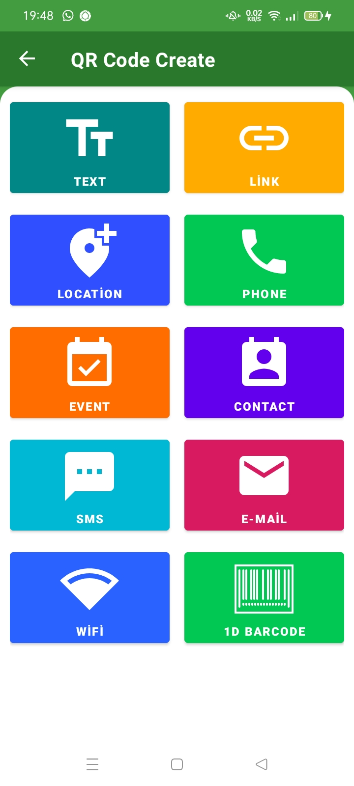
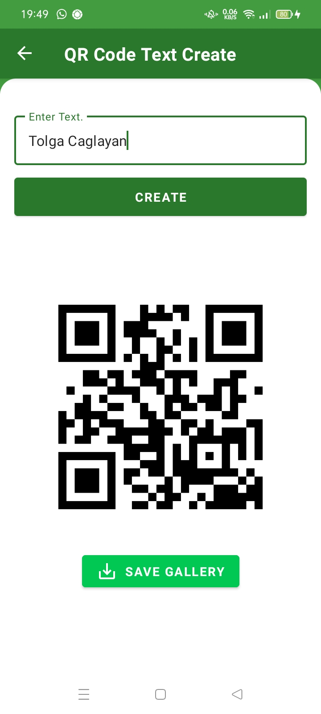
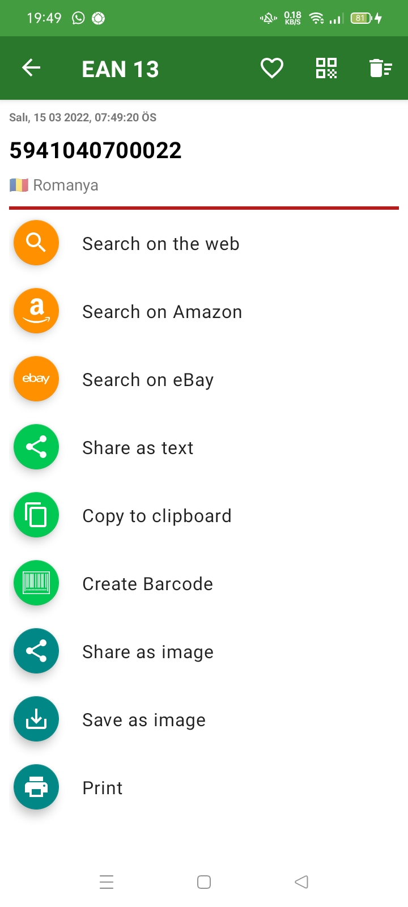

# Android Barcode Reader and Create

Most of the project is finished. I will add some missing parts over time.

* Android Kotlin
* Livedata & View Model
* Android cameraX
* Material UI
* Android Jetpack Navigation

  
  
  
  
  
  

